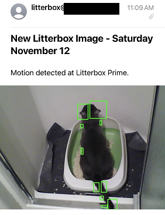

# Motion Detecting Litter Box Camera

This repo contains a simple program to send me an email each time my cat steps into her litterbox to poop or piddle. This is just a personal storage repo that uses OpenCV and a basic Wi-Fi camera that uses basic HTTP authentication.

Be sure to set these _REQUIRED_ environment variables for your local run or when you create an image with the Docker file and spin up a container.

| env variable  | example value |
| ------------- | ------------- |
| `EMAIL_USER`  | `username`  |
| `EMAIL_PASS`  | `goodpassword123`  |
| `CAM_USER`  | `http_auth_user`  |
| `CAM_PASS`  | `http_auth_pw`  |
| `IMG_URL`  | `http://192.168.1.xxx/image.jpg`  |
| `FROM_EMAIL`  | `catpoop@domain.gov`  |
| `TO_EMAILS` (comma separated for multiple)  | `victim1@email.com,coolguy89@donkey.org`  |
| `SMTP_SERVER`  | `email-smtp.us-east-1.amazonaws.com`  |
